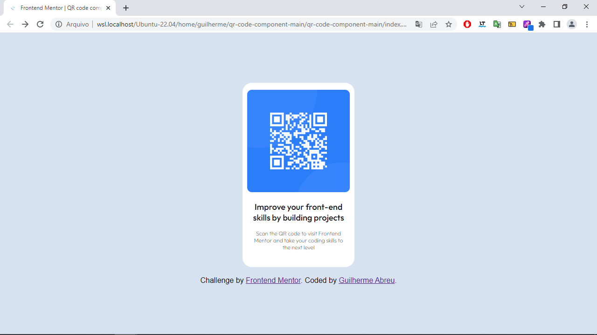

# Frontend Mentor - QR code component solution

Esta é uma solução para o [desafio do componente de código QR no Frontend Mentor](https://www.frontendmentor.io/challenges/qr-code-component-iux_sIO_H). Os desafios do Frontend Mentor ajudam você a melhorar suas habilidades de codificação criando projetos realistas.

## Índice

- [Screenshot](#screenshot)
- [Links](#links)
  - [Construido com](#construido-com)
  - [Oque aprendi](#oque-aprendi)
- [Desenvolvimento continuo](#desenvolvimento-continuo)

### Screenshot

### Links

- Solution URL: 
- Live Site URL: 

### Construido com

- Semantic HTML5 markup
- CSS custom properties
- Flexbox

### Oque aprendi

Aprendendo e pondo em pratica os conceitos de Flexbox, aperfeiçoando também o conceito de Box model, deixando o codigo HTML mais semanticamente mais organizado.

### Desenvolvimento continuo

Agora é estudar mais e por mais em pratica, tudo aquilo que adquirido de conhecimento e cada vez mais aperfeçoar as boas praticas e melhorar cada vez os codigo, assim mantendo o conceito de clean code. Proximo passo agora é parti pra logica de programção com JavaScript e logo em seguida React. Foco é se tornar um bom FrontEnd
